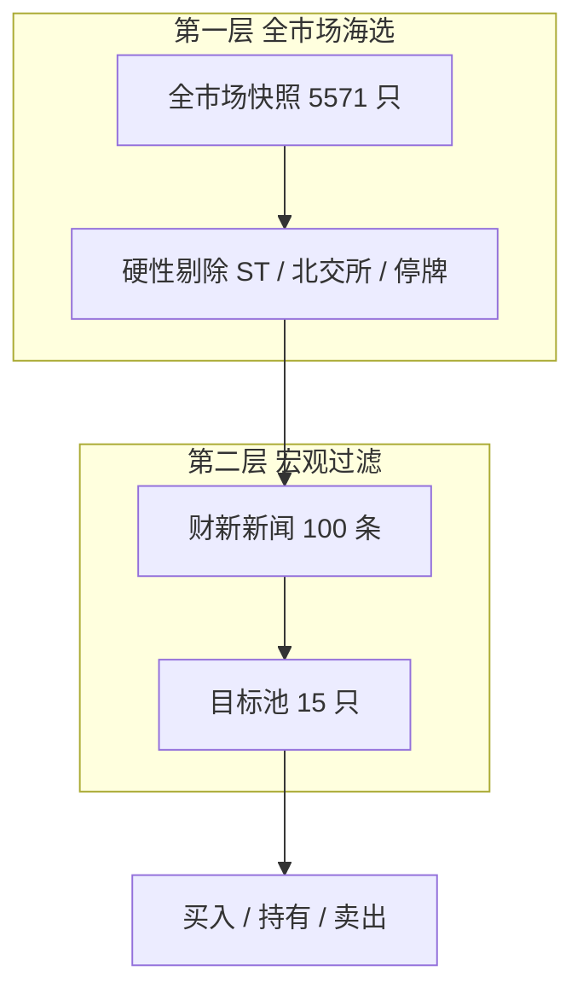
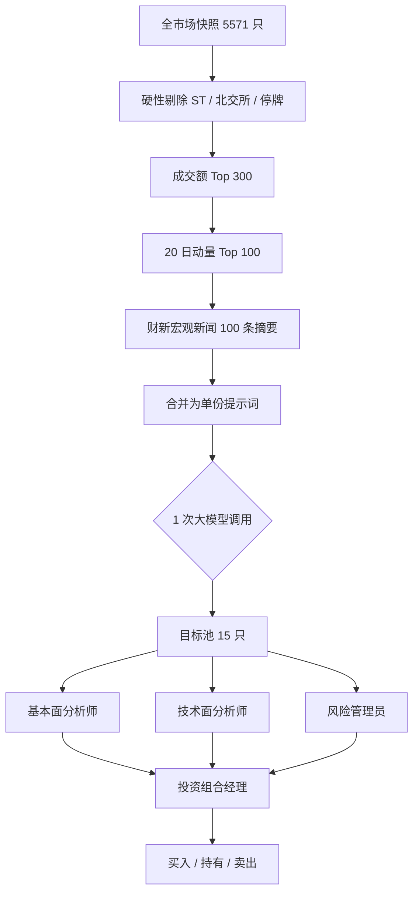
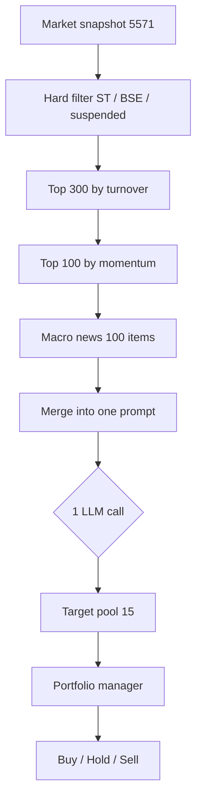
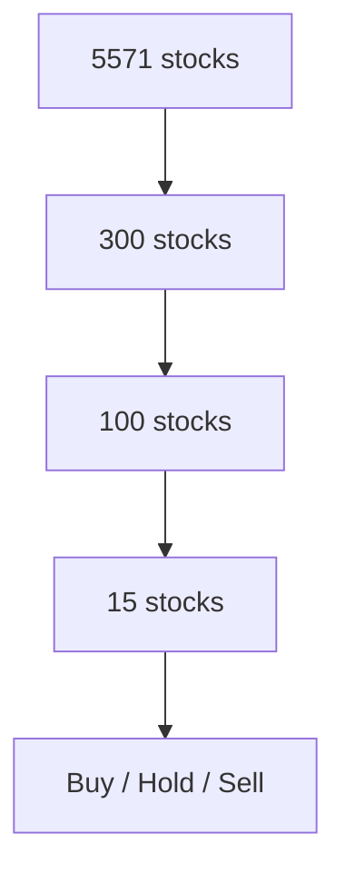

# Mermaid 渲染兼容性测试

这是一个**临时测试文件**，用于定位哪种 Mermaid 语法能在 GitHub 上正常渲染。
请告诉我哪些变体渲染成了图、哪些显示 `Unable to render rich display`。

## 变体 1: subgraph + ID标签 + 中文（当前版本）

## 变体 2: 无 subgraph + 中文标签

## 变体 3: 无 subgraph + 纯英文标签

## 变体 4: 极简

