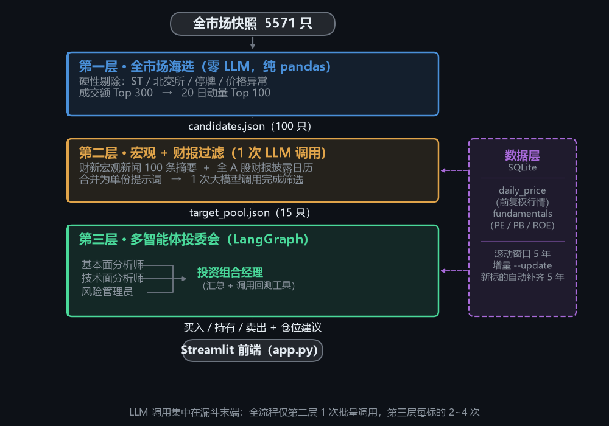
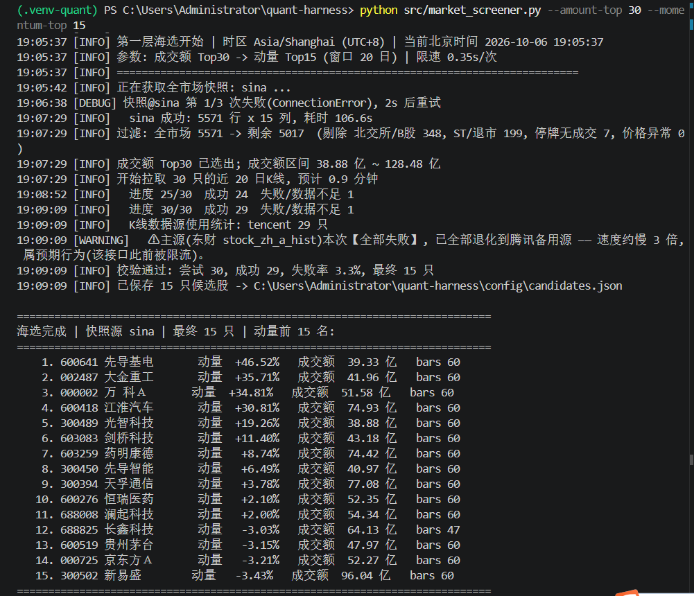
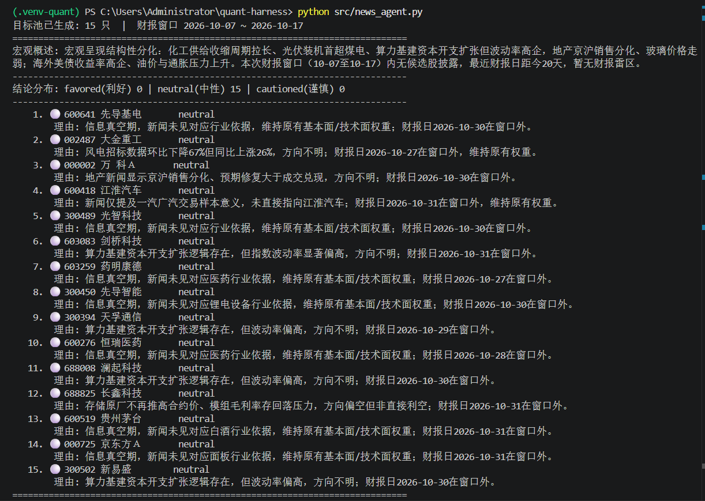
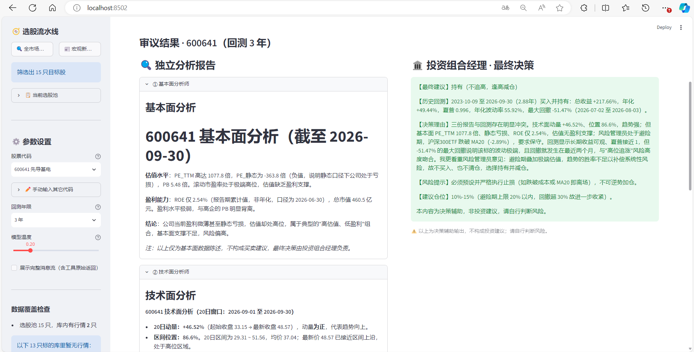
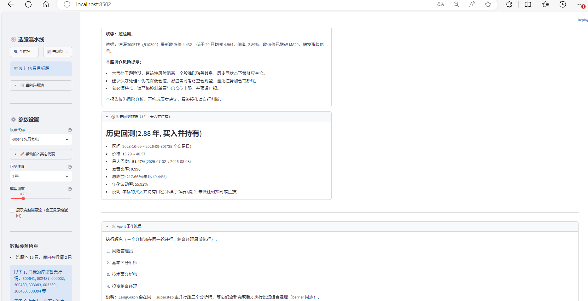

# 📈 Quant-Harness：基于 LangGraph 的多智能体量化投研系统

> **🔗 在线演示 (Live Demo)**：[点击这里直接体验运行效果](https://quant-harness-kdza2k6d9nr2alqf6geo6d.streamlit.app)
> *(注：AI 深度决策需调用大模型接口，建议在左侧输入代码后点击"召开投资委员会"体验)*

<p align="left">
  
  
  
  
</p>

## 📖 项目简介

Quant-Harness 是一个面向个人投资者的**全栈 AI 投研辅助系统**。

针对传统量化系统"只看 K 线、不懂政策"的痛点，本项目引入了大语言模型（LLM）与多智能体（Multi-Agent）架构，结合传统量化风控逻辑，实现了从**全市场数据海选**到**智能投委会决策**的完整闭环。

**核心设计取舍**：把昂贵的 LLM 调用放在漏斗末端。先用**纯代码**把 5000+ 标的筛到 15 只，再交给模型 —— 而不是让模型去看全市场。

---

## 🏗️ 核心架构：三层漏斗过滤系统

为了平衡大模型 API 成本与全市场数据处理算力，系统采用三层漏斗式架构：



### 各层数据流

| 阶段 | 输入 | 处理 | 输出 | LLM 调用 |
|---|---|---|---|---|
| ① 海选 | 全市场快照 **5571** 只 | 硬性剔除 → 成交额 Top 300 → 动量 Top 100 | `candidates.json` **100** 只 | ❌ 零 |
| ② 宏观+财报 | 100 只候选 | 100 条财新新闻 + 财报日历 → 合并提示词 | `target_pool.json` **15** 只 | ✅ **1 次** |
| ③ 决策 | 15 只目标 | 3 分析师并行 → 组合经理汇总 | 买入/持有/卖出 + 仓位 | ✅ 每标的 2~4 次 |

### 各层职责

| 层 | 模块 | 是否调用大模型 | 输出 |
|---|---|---|---|
| ① 海选 | `src/market_screener.py` | ❌ 零消耗 | `config/candidates.json`（100 只）|
| ② 宏观+财报 | `src/news_agent.py` | ✅ **1 次** | `config/target_pool.json`（15 只）|
| ③ 决策 | `quant_agent.py` | ✅ 每标的 2~4 次 | 买入/持有/卖出 + 仓位建议 |
| 数据层 | `src/data_center.py` | ❌ | `data/quant_data.db` |
| 前端 | `app.py` | — | Streamlit 界面 |

### 逐层说明

**1. 第一层（海选层） - `src/market_screener.py`**
- 扫描全市场 5000+ 只股票，剔除 ST、北交所、停牌标的。
- 按成交额排序（Top 300）后计算 20 日动量，筛选出前 100 只作为候选池。
- *纯 Pandas 运算，零大模型消耗，速度极快。*



**2. 第二层（宏观层） - `src/news_agent.py`**
- 接入财新宏观新闻（100 条摘要）与全 A 股财报预约披露日历。
- **一次合并大模型调用**（控制 Token 消耗），对候选股进行"宏观情绪 + 财报雷区"双重过滤，收敛至 15 只目标股。



**3. 第三层（决策层） - `quant_agent.py`**
- 基于 **LangGraph** 编排多智能体投委会：
  - 📊 **基本面分析师**：查询 PE/PB/ROE 等估值指标。
  - 📉 **技术面分析师**：计算动量、区间位置。
  - 🛡 **风险管理员**：判断大盘 MA20 避险状态。
  - 🏛 **投资组合经理**：汇总三方意见 + 调用回测工具，给出最终的买入/持有/卖出决策。




---

## 📊 核心指标（实测值，非估算）

| 指标 | 实测数值 | 说明 |
|---|---|---|
| 全市场标的数 | **5571** | 快照一次拉取 |
| 硬性过滤后 | **5017** | 剔除 348 交易所 + 199 ST + 7 停牌 |
| 成交额 Top | **300** | 进入动量计算 |
| 动量 Top | **100** | 写入候选池 |
| 海选耗时 | **约 24 分钟** | 300 只 × 腾讯源 3s + 主动限速 |
| 目标池规模 | **15** | 第二层输出 |
| **大模型调用次数** | **1 次**（第二层）| 对比：无漏斗需对候选池逐只调用 |
| 第二层单次提示词 | **7123 字 ≈ 3561 tokens** | 100 条新闻摘要 + 15 只标的 |
| 第二层耗时 | **约 8 秒** | 含数据抓取与模型返回 |

---

## 🚀 工程亮点与踩坑实录

这部分是本项目最有价值的部分 —— 每个问题都是**实测发现**，不是设想。

*   **大模型防幻觉护栏**：引入"信息真空期"概念。如果某只股票既无新闻依据也无近期财报，**提示词层 + 代码层双重约束** —— 提示词禁止把"无数据"当利好；代码层的 `enforce_vacuum_neutral()` 会强制校验并**覆盖**大模型输出，强制其保持"中性"立场，绝不允许无中生有。
*   **多源数据灾备容灾**：实测发现东方财富接口存在稳定限流（K 线接口完全不可用）。代码中设计了多级降级策略，个股行情自动降级到腾讯源，ETF 自动降级到新浪源，保证系统永远可用。
*   **动态数据与增量维护**：设计了基于 SQLite 的 5 年滚动窗口机制。通过 `--update` 模式实现逐标的增量更新，并在每次运行后自动清理过期数据，防止数据库膨胀。
*   **全局时区约束**：强制使用 `Asia/Shanghai` 北京时间，解决云端服务器（如 UTC 时区）部署时产生的日期错乱与财报计算误差问题。

### 以下是修复过程中发现的更深层问题

**1. ROE 前视偏差：一个会静默污染所有回测的 bug**

**问题**：`ROE` 的报告期末日 ≠ 数据可用日。A 股年报报告期是 `12-31`，但实际披露要到**次年 3~4 月**。原实现直接拿报告期末日当"可用日"，导致回测在 **1 月就"知道"了 12-31 的年报 ROE** —— 而那份财报当时根本还没公布。

**为什么危险**：程序不报错、数据看起来完整，只是**结论是错的**。这类静默错误比崩溃更可怕。

**修复**：新增 `roe_available_from()`，按 **A 股法定披露截止日**换算可用日，并把 `roe_available_from` 作为独立列持久化 —— 每一行都能自证"这个 ROE 在当时是否真的可得"。

| 报告期 | 法定可用日 | 滞后 |
|---|---|---|
| 03-31（一季报）| 当年 04-30 | 30 天 |
| 06-30（中报）| 当年 08-31 | 62 天 |
| 09-30（三季报）| 当年 10-31 | 31 天 |
| **12-31（年报）** | **次年 04-30** | **120 天** ← 主要偏差来源 |

**验证证据**（真实数据，全库 11880 行）：
```
[违反前视偏差的行数] = 0

交易日 2024-01-02  ROE=24.82  报告期=2023-09-30  可用日=2023-10-31
交易日 2024-04-29  ROE=24.82  报告期=2023-09-30  可用日=2023-10-31
交易日 2024-04-30  ROE=34.19  报告期=2023-12-31  可用日=2024-04-30  ← 切换点精确
```
修复前 2024-01-02 会取到**尚未公布**的 2023 年报 ROE（34.19），与真实可得的 24.82 **相差 9.37 个百分点**。

**2. `--update` 只覆盖硬编码标的，导致数据静默冻结**

**问题**：增量更新原先只迭代**硬编码的 5 只** `UNIVERSE`，而库里可能已通过 `--symbol` / `--pool` 累积了更多标的。那些标的**永远不会被更新，也没有任何提示**。

**实测症状**：库内 11 只标的，`--update` 只刷新 5 只，其余 6 只静默冻结在旧日期（表现为"某只 ETF 的价格一直停在过去某一天"）。

**修复**：新增 `known_symbols()`，`--update` 改为覆盖**库内全部标的**，与"数据库只保留最近 N 年"的滚动窗口语义保持一致。

**3. 逐标的基准 vs 全局基准：新标的数据静默缺失**

**问题**：原增量更新用**一个全局** `SELECT MAX(trade_date)` 当所有标的的起算点。后果：**新加入的标的在库里查不到，会错误沿用别的标的的最后日期**，于是只拉 4 天数据，而不是它需要的 5 年历史。

**修复**：逐标的判断缺口
```
该标的在库里有记录 → 从"它 + 1 天"开始    （真增量）
该标的在库里不存在 → 从"今天 − 5 年"开始  （新标的补齐）
```
这同时天然覆盖"被滚动清理掉的标的需重新补全"。

**4. 个股新闻接口的排查过程（本项目最硬核的一次排错）**

`stock_news_em`（东财个股新闻）不可用，且**两层原因都不是限流**：
1. akshare 自身 bug —— 用 `.str.replace(r"\u3000", ...)` 触发 pandas 3.0/pyarrow 的 `invalid escape sequence: \u`，**HTTP 请求成功，崩在返回前 2 行的清洗步骤**
2. 绕过该 bug 直连底层 JSONP 接口后，发现更根本的原因：**把 `param` 故意写成非法字符串，服务端返回与正常请求完全相同的响应** → 说明它已**完全忽略请求体**，属于**接口契约变更，修 bug 也救不回来**

**结论**：改为"宏观新闻 + 财报预警"组合，放弃逐只个股新闻，换取稳定数据源。

**5. Windows 环境下的三个真实坑**

| 坑 | 现象 | 处置 |
|---|---|---|
| 匿名管道被禁 | `subprocess` 用 `PIPE` 捕获输出会 `WinError 5` | 改用**文件重定向**到项目内 `.tmp/` |
| 子进程编码 | 中文输出按 GBK 编码，父进程按 UTF-8 读成乱码 | 子进程强制 `PYTHONIOENCODING=utf-8` |
| matplotlib 字体缓存 | 默认缓存目录不可写 | 降级到项目内 `.mplconfig/` |

---

## 💻 技术栈

- **AI 框架**：LangGraph, LangChain, DeepSeek API (LLM)
- **数据层**：SQLite, Pandas, Akshare (金融数据接口)
- **回测与指标**：Backtrader, NumPy
- **前端交互**：Streamlit
- **工程化**：Git, Streamlit Community Cloud

---

## 🛠️ 本地运行指南

```bash
# 1. 克隆仓库
git clone https://github.com/yrd-go/quant-harness.git
cd quant-harness

# 2. 安装依赖
pip install -r requirements.txt

# 3. 配置环境变量（新建 .env 文件，不要提交到 git）
echo "DEEPSEEK_API_KEY=你的Key" > .env

# 4. 初始化数据库（首次运行）
python src/data_center.py

# 5. 启动前端
streamlit run app.py
```

### 数据层三种模式

```bash
python src/data_center.py                    # 全量建库（DROP 重建）
python src/data_center.py --update           # 增量更新（覆盖库内全部标的）+ 滚动清理
python src/data_center.py --symbol 600418    # 只补齐指定标的（新标的自动补 5 年）
python src/data_center.py --pool             # 按 config/target_pool.json 补齐
python src/data_center.py --rebuild-fundamentals --update   # 基本面口径变更后回填历史行
```

### 选股流水线

```bash
python src/market_screener.py --amount-top 30 --momentum-top 15   # 第一层（先小规模试跑）
python src/news_agent.py --earnings-window 25                     # 第二层（放宽财报窗口看效果）
python quant_agent.py --symbol 600418 --years 3                   # 第三层（命令行单标的）
```

> **提示**：`--update` 在周末/节假日会打印"无新数据可更新, 属于非交易日"并 **exit 0** —— 这是设计行为，不是失败。

---

## ✅ 测试

```bash
python tests/run_tests.py          # 全部 34 个用例
python tests/run_tests.py -q       # 只看汇总
python tests/run_tests.py vacuum   # 只跑名字含 vacuum 的
```

退出码 `0` = 全部通过，`1` = 有失败（可直接用于 CI）。

**零依赖**：不依赖 pytest（部署环境网络受限，PyPI 下载常超时），自带一个 30 行的迷你 runner。

### 覆盖范围

| 测试文件 | 覆盖什么 | 用例数 |
|---|---|---|
| `test_roe_available.py` | ROE 法定披露日映射（含年报 120 天滞后）| 8 |
| `test_fetch_start.py` | 逐标的基准（新标的回补 5 年 / 老标的 +1 天）| 6 |
| `test_roll_cleanup.py` | 滚动清理幂等性与 cutoff 边界 | 8 |
| `test_vacuum_neutral.py` | **信息真空期强制改写（注入测试）** | 12 |

### 测试的有效性经过验证（变异测试）

一次就全过的测试很可能是"假测试"（断言太松、或压根没测到）。所以用**变异测试**验证保护力 —— 故意把源码改坏，看能否被抓到：

| 注入的缺陷 | 是否被抓 | 失败用例数 |
|---|---|---|
| 关掉信息真空期护栏 | ✅ 抓到 | 6 |
| 真空期判定放宽（把"有财报"也算真空）| ✅ 抓到 | 2 |
| ROE 年报改成"报告期当天可用"（即前视偏差）| ✅ 抓到 | 2 |
| 逐标的基准退化为全局基准（新标的只拉 1 天）| ✅ 抓到 | 3 |

**4/4 全部被抓到**，还原源码后 34/34 恢复通过 —— 说明这些测试在真实退化时会失败，而不是永远绿灯。

---

## ⚠️ 已知局限

**主动列出，因为知道边界比假装没有边界更重要。**

### 1. ROE 累计期口径不齐（待修）

`stock_financial_abstract` 返回的 ROE 是**报告期累计值**：Q1 是 3 个月、中报是 6 个月、三季报是 9 个月、年报是 12 个月。实测还发现**年报 ROE 时有时无**，导致：

```
报告期 2024-03-31 -> ROE = 10.57   （3 个月）
报告期 2024-06-30 -> ROE = 17.63   （6 个月）
报告期 2024-09-30 -> ROE = 26.09   （9 个月）
报告期 2025-03-31 -> ROE = 10.92   （3 个月）
```

**两个后果**：
- 跨越 4-30 时 ROE 从 24.82 **跳降到** 10.57，看似"盈利能力恶化"，其实只是换了个报告期
- 横截面比较时，不同股票的 ROE 对应不同长度的累计期，`factor_score.py` 的 `quality_rank` 是在**拿 9 个月的 ROE 和 12 个月的 ROE 排名**

**计划修法**（三选一）：改用 TTM ROE / 年化各期 / 只在**同报告期**之间排名（`roe_report_period` 字段已具备）。

### 2. 组合经理的回测口径不含交易成本

`quant_agent.py` 的 `run_backtest` 工具是**单标的买入并持有**口径，代码内已如实标注"不含手续费/滑点, 未做任何择时或止损"。

对比：`src/backtest.py` 的**独立回测引擎做对了** —— 手续费万分之三、滑点千分之一，并显式传 `slip_open=True` 修掉了 backtrader"市价单滑点不作用于开盘价"的坑。**两套口径目前没有统一**。

**计划**：让 Agent 的回测工具复用 `backtest.py` 的成本口径，或同时给出含/不含成本两个版本。

### 3. 尚无滚动样本外验证

漏斗选出 15 只之后，**目前没有机制回答"这 15 只后来涨了吗"**。系统输出的是"分析"，不是"经过验证的策略"。

**计划**：对 T-1 日跑完整漏斗 → 记录选股 → 计算 T 到 T+20 实际收益 → 滚动重复 → 与沪深300基准对比。这是唯一能回答"三层漏斗到底有没有 alpha"的实验。

### 4. `UNIVERSE` 仍是硬编码兜底

`src/data_center.py` 的 `UNIVERSE` 硬编码 5 只作为兜底。虽然已支持 `--pool` / `--symbol` / 全库增量更新，但默认全量建库仍只建这 5 只。

### 5. 测试覆盖仍不完整

已有 34 个用例（见上文「✅ 测试」），并用变异测试验证了保护力。但覆盖的仍是**最容易静默出错**的那 4 处，以下尚未覆盖：

- 海选失败率口径（`1 - 成功/尝试`，**不是** `1 - 保留/尝试`）
- `news_agent` 的财报日历匹配（`match_earnings` 的窗口边界）
- `enforce_vacuum_neutral` 之外的第二层解析逻辑（`parse_llm_json` 的畸形输入）
- `backtest.py` 的资金曲线与指标计算（`compute_metrics`）

**已修复**：逐标的基准、滚动清理幂等性、ROE 披露日映射、信息真空期强制改写 —— 这 4 项均已固化为回归测试。

---

## 📁 项目结构

```
quant-harness/
├── app.py                    # Streamlit 前端（选股流水线 + 自动拉取 + 投委会）
├── quant_agent.py            # LangGraph 多智能体编排 + 4 个数据工具
├── config.py                 # 统一配置（时区 / 滚动窗口 / 限速 / 路径）
├── run_sensitivity.py        # 参数敏感性批量跑批
├── src/
│   ├── data_center.py        # 数据层：全量 / 增量 / 补齐 三模式 + 滚动清理
│   ├── market_screener.py    # 第一层：全市场海选
│   ├── news_agent.py         # 第二层：宏观新闻 + 财报预警过滤
│   ├── backtest.py           # Backtrader 回测引擎（含手续费/滑点/止损/双均线）
│   ├── factor_score.py       # 多因子打分
│   ├── plot_heatmap.py       # 参数热力图
│   └── quant_demo.py         # 日线抓取与绘图示例
├── tests/                    # 零依赖测试套件（python tests/run_tests.py）
│   ├── run_tests.py          # 入口
│   ├── _runner.py            # 迷你测试框架（不依赖 pytest）
│   ├── test_vacuum_neutral.py   # 信息真空期强制改写（注入测试）★
│   ├── test_fetch_start.py      # 逐标的基准
│   ├── test_roll_cleanup.py     # 滚动清理幂等性
│   └── test_roe_available.py    # ROE 法定披露日映射
├── architecture.png          # 架构图
├── config/                   # candidates.json / target_pool.json（脚本产物）
├── logs/                     # 各脚本独立日志
└── data/quant_data.db        # SQLite（滚动的最近 5 年）
```

> **路径注意**：`app.py`、`quant_agent.py`、`config.py`、`run_sensitivity.py` 在**项目根目录**；其余脚本在 **`src/`** 下。`config/` 是**数据目录**（放 JSON 产物），不是 Python 模块。

---

## 📄 License

个人学习与研究项目。本工具仅做决策辅助，**不构成任何投资建议**。
